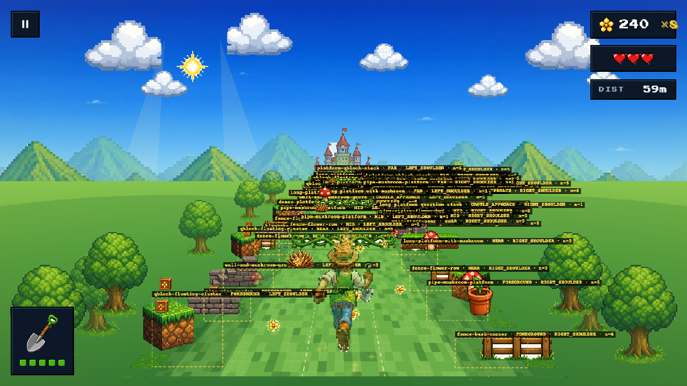

# Composition Analysis — Phase 9 Garden Corridor Reference

Generated 2026-05-31T03:17:03.447Z.  Seed: `42`.

## Checklist (answered programmatically)

| Question | Result |
|---|---|
| Does the foreground frame the player? | ✅ YES |
| Are side structures composed (clusters, not single stickers)? | ✅ YES |
| Is the road-to-castle axis clear at far distance? | ✅ YES |
| Are signature elements visible (purple_brick / green_pipe / question_block / mushroom)? | ✅ YES |
| No wrong-side or floating items (validator counters)? | ✅ YES |
| Gameplay readability preserved (no scenery decor in road core)? | ✅ YES |

## Signature elements visible across captures

| Element | Present |
|---|---|
| purple_brick | ✅ YES |
| green_pipe | ✅ YES |
| question_block | ✅ YES |
| mushroom | ✅ YES |
| fence | ✅ YES |
| platform | ✅ YES |

## Per-distance snapshot

All counts are **scenery entities only** (ECS query: `ScenicData, Sprite, Position`). Gameplay road content — vines, dry grass obstacles, golden flowers, rare orchids, powerups — flow through `Hitbox` / `CollectibleData` queries and are deliberately NOT counted here. The "Road-core" column therefore measures *decor bleed into the player lanes*, not gameplay availability.

| Distance | Scenery total | L / R | Road-core scenery | Placement viol. | Composition viol. |
|---|---|---|---|---|---|
| 10m | 219 | 104 / 115 | 0 | 0 | 0 |
| 30m | 244 | 122 / 122 | 0 | 1 | 0 |
| 70m | 247 | 122 / 125 | 0 | 2 | 0 |
| 120m | 236 | 118 / 118 | 0 | 4 | 0 |
| 180m | 232 | 116 / 116 | 0 | 4 | 0 |

## What HERO_LAYOUT places at each capture distance

### 10m
- `garden_foreground_left_platform_cluster` @ 18m · side=LEFT · scale 1
- `garden_foreground_right_pipe_cluster` @ 25m · side=RIGHT · scale 1

### 30m
- `garden_foreground_left_platform_cluster` @ 18m · side=LEFT · scale 1
- `garden_foreground_right_pipe_cluster` @ 25m · side=RIGHT · scale 1
- `fence-flower-row` @ 42m · side=LEFT · scale 0.85

### 70m
- `fence-flower-row` @ 52m · side=RIGHT · scale 0.82
- `garden_mid_left_purple_wall_cluster` @ 70m · side=LEFT · scale 0.78
- `garden_mid_right_stone_step_cluster` @ 82m · side=RIGHT · scale 0.75

### 120m
- `corner-platform-mushroom-frame` @ 112m · side=RIGHT · scale 0.62
- `garden_mid_left_purple_wall_cluster` @ 130m · side=LEFT · scale 0.5

### 180m
- `garden_far_castle_approach_cluster` @ 165m · side=LEFT · scale 0.4
- `garden_far_castle_approach_cluster` @ 175m · side=RIGHT · scale 0.38
- `leaf-forest-edge` @ 195m · side=LEFT · scale 0.34

## Debug overlay capture

`debug_overlay_50m.png` is captured with `?debugComposition=1&showCompositionGroups=1` so the prefab group bounding boxes, depth-band tag, side shoulder, and the 6-line semantic badge are visible per entity. Use it to verify: every cluster has a yellow dashed bbox; every badge reads `role · zone · side · coll · sup`; no entity shows `INVALID`.

## Notes

- All checks above are derived from live `window.__ORCHID_DEBUG__.getState()` and the registered ECS scene entities — not from heuristics over the PNG bytes.
- A ❌ on "no wrong-side / floating items" indicates `PlacementValidator` flagged a real runtime violation. Inspect the report at `docs/composition-validation-report.md`.
- The capture is deterministic per `SEED`. Re-run with `CAPTURE_SEED=99 node scripts/capture-composition-pass.mjs` to A/B another seed.

## Reference companions

- `docs/asset-semantic-registry.md` — canonical role / zone / collision per asset.
- `docs/composition-validation-report.md` — hard / warn violations from `node scripts/validate-composition.mjs`.
- `docs/visual-qa/composition-current/contact-sheet.png` — visual side-by-side.